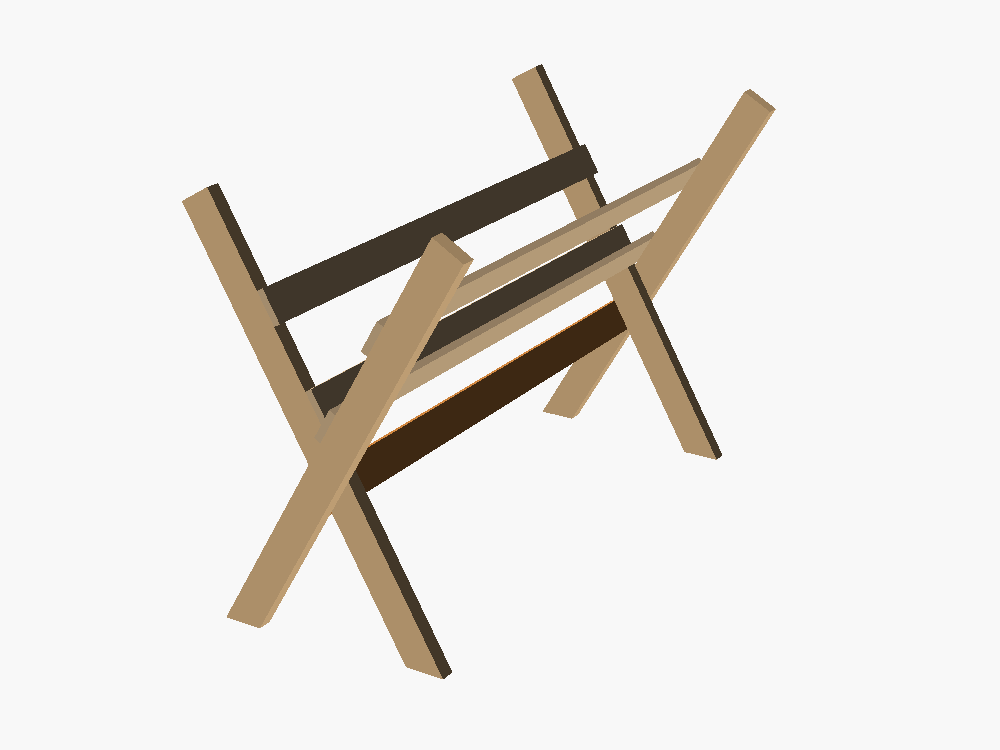
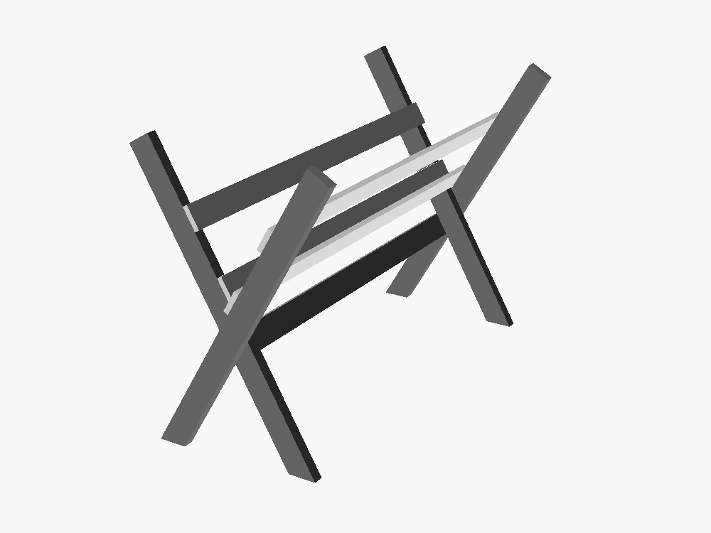

# Forage fork

A parametric OpenSCAD model of a sawbuck-style browse rack for goats: two
2x4 X-frames, 1x4 cradle rails along the inside faces of the arms, and a 2x4
run under the crossings to stop the frame scissoring.



## The two main parameters

| | | |
|---|---|---|
| `cross_angle` | included angle of the X | wider = shallower trough, wider stance |
| `fork_height` | ground to top of the arms | |

Everything else is derived from those two plus `fork_length` and
`cross_frac` (where along the height the legs cross).

## Using it

Open `forage-fork.scad` in OpenSCAD. The parameters are grouped into
Primary / Secondary / Cradle rails / Stop block / Display, so the
**Customizer** panel (View → Hide Customizer to toggle) gives you sliders
for all of them. `shade_by_stock`, under Display, is worth knowing about —
see [Parts](#parts).

The console prints a cut list and a set of clearance checks on every render:

```
== Forage fork ==================================
  cross angle .......... 60 deg
  height ............... 34 in
  length ............... 60 in
  crossing height ...... 17 in
  trough bottom ........ 20.5 in
  stance (foot to foot) . 23.6714 in
  top opening .......... 23.6714 in
-- cut list ------------------------------------
  4 x  2x4  legs   @ 41.2805 in long point, both ends cut at 30 deg off square
  2 x  1x4  rails  @ 60 in (on the outer legs)
  2 x  1x4  rails  @ 57 in (on the inner legs)
  1 x  2x4  stop   @ 57 in, square ends
  joint at crossing: face-to-face, bolted
-- clearances ----------------------------------
  between the two upper rails ..... 11.5498 in
  crook rail bottoms out at ....... 20.875 in (trough vertex is at 20.5)
  second rail rests at ............ 21.625 in
  clear arm above crook rail ...... 7.16581 in
  clear arm above second rail ..... 6.29978 in
  stop spans 12.6095 to 16.3905 in above ground (crossing is at 17)
  stop end bears 3.5 in of its 3.78109 in width on the outer leg
================================================
```

Note the leg length is the **long point** — both ends are cut at
`cross_angle / 2` off square, so the boards sit flat on the ground and the
arm tops are level.

## Parts

- **4 × 2x4 legs.**
- **4 × 1x4 cradle rails**, two pairs run along the *inside* faces of the
  arms. The upper pair sits level, set by `upper_rail_inset` measured from the
  top of the arm down along the board to the rail's upper edge. The lower pair
  is staggered — see below.

  They come in **two lengths**. Since each cross is two boards face to face,
  one leg of each cross finishes flush with the end of the rack and the other
  is set in by a board thickness. Each rail is cut to the leg it lands on —
  `fork_length` on the outer legs, `fork_length − 3"` on the inner ones — so
  both pairs finish flush instead of one running past. (Half-lapped crosses
  put both legs in one plane, so there all four rails are `fork_length`.)
- **1 × 2x4 stop**, square ends, run lengthwise just below the crossings.
  Cut to `fork_length − 3"` so it fits between the two outer legs.

Set `shade_by_stock = true` to shade the boards by stock instead of by part —
every 2x4 **gray**, every 1x4 **white** — so you can see at a glance which is
which. The stop shades with the legs, since it is a 2x4 like them.



The white boards carry their form from OpenSCAD's face shading rather than
from their fill, so on a pale background their outermost edges can fade out.
Render against a darker colour scheme if you need the silhouette to hold.

## The stop

Each cross is a single bolt, so in its own plane the frame is a hinge with
nothing triangulating it. The stop is what fixes that.

It runs the length of the rack, below the crossings, with one wide face flat
against the underside of the two **inner** legs and parallel to them. Its
square-cut ends butt the inside surfaces of the two **outer** legs. So it
touches both boards of both crosses, and screwing it to each makes a triangle
out of the hinge.

Because it lies on the inner leg, sliding it along that leg sweeps its end
across the outer leg's cross-section — which is what decides whether the
ends land on anything. `stop_drop = 0` centres them, and the seat works out
just under the crossings. Slide it down for a wider triangle and the legs
diverge away from the ends fast:

| `stop_drop` | end bearing on the outer leg |
|---|---|
| 0" | the whole end face |
| 2" | about two thirds of it |
| 5" | ~0 — the end lands on nothing |

The end presents `1.5·cos(2a) + 3.5·sin(2a)` of width across the outer leg,
which grows past 3.5" once `cross_angle` opens beyond about 43°. From there
the ends overhang the leg slightly no matter where you slide them — 0.28" at
the default 60°, so a sliver of end grain stands proud. The console echoes the
bearing so you can see how far it has gone.

## The staggered lower rails

Sliding a rail down its arm carries it toward the vertex, where the narrowing
V pinches it. Two rails set *level* with each other jam against one another at
the centreline well before either gets near the crook — so they can't both go
low. Dropping them one at a time gets both much deeper:

- The **crook rail** goes in first and seats when its lower inner corner lands
  on the opposite leg's inner face.
- The **second rail**, on the other arm, then comes to rest on the first one's
  exposed face — one board thickness further into the V, which is exactly what
  holds it a little higher.

Both seats are solved rather than dialled in, so they track `cross_angle`.
`crook_rail_lift` and `second_rail_lift` raise either rail back up its arm from
where it seats; the console reports both heights against the trough vertex.

## Notes on the geometry

- **Trough bottom is not the crossing height.** Because the legs are 3.5"
  wide, the inner faces don't meet until `3.5 / (2 sin(cross_angle/2))` above
  the crossing — 3.5" at 60°. That's why `cross_frac` defaults to 0.5 rather
  than something higher: it keeps the usable trough deep.
- **Stance and top opening are equal** when `cross_frac = 0.5`. Lower it for
  a wider foot and a deeper trough; raise it for a wider mouth.
- **The inside rails compete for space near the bottom of the V.** That's what
  forces the lower pair to be staggered rather than level — see above.

## The crossing joint

`half_lap = false` (default) puts the two boards face-to-face and bolts
through — one carriage bolt per crossing, no joinery. The frame is 3" thick.

`half_lap = true` notches each board halfway so they finish flush at 1.5".
Stronger and tidier, but it's an angled lap that has to be cut by hand.
The notch is `3.5² / sin(cross_angle)` in area, so it grows fast as the
angle gets shallow. Keep `cross_angle` at 35° or more if you lap it.
